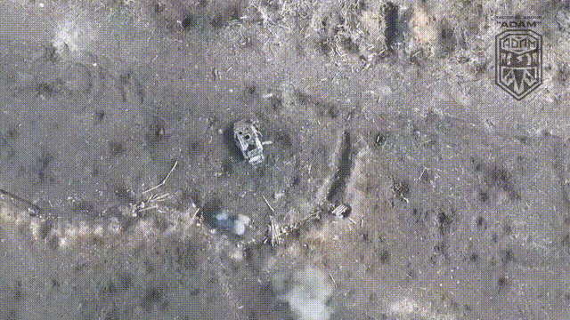
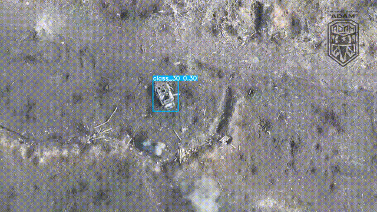
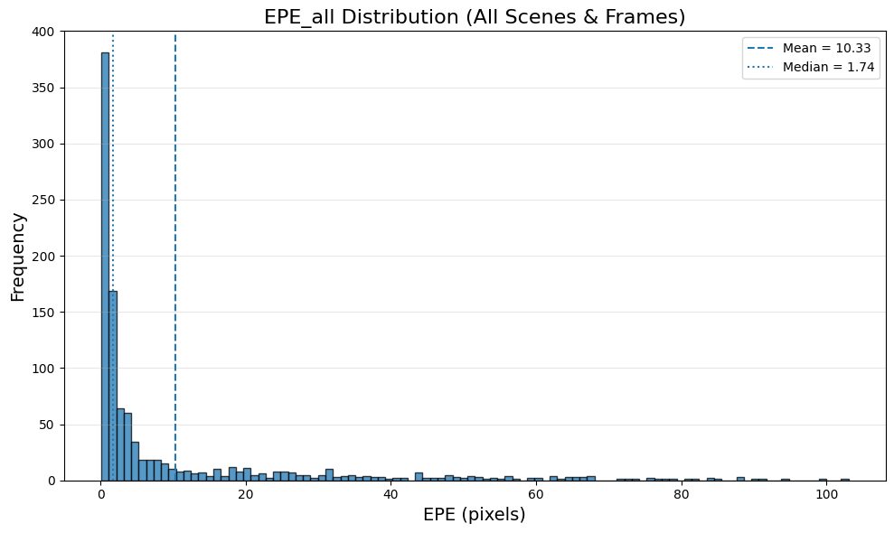
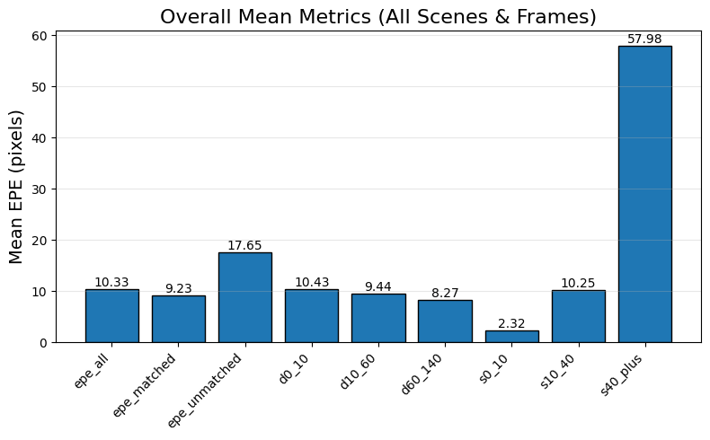
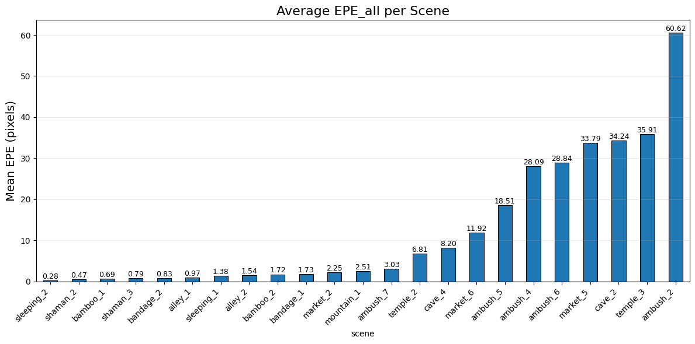

# Camouflage Unmasking: Optical-Flow–Driven Soldier Detection in Warzone Drone Surveillance

[](LICENSE.md)
[]()

## 📖 Project Overview
This repository provides a complete pipeline for detecting camouflaged soldiers in aerial drone footage by combining optical-flow preprocessing with YOLOv5 object detection. It includes multiple optical-flow algorithms, benchmarking utilities, training scripts, inference tools, and result visualizations.

## 📁 Repository Structure
```text
├── __pycache__/                   # Python bytecode cache
├── drone_footage/                 # Raw .mp4 drone videos
├── extracted_frames/              # Frames extracted from videos
├── output/                        # All outputs organized by module
│   ├── LK_optical_flow/           # Lucas–Kanade flow results
│   ├── dense_optical_flow/        # Dense optical flow results
│   ├── raft_optical_flow/         # RAFT optical flow results
│   ├── pytorch_spynet/            # SpyNet optical flow results
│   ├── modified_dof/              # Custom DOF preprocessing outputs
│   ├── benchmark_all/             # Benchmark metrics CSVs
│   ├── benchmark_all_plots/       # Benchmark performance plots
│   ├── object_detection/          # Detection outputs
│   │   └── xview_inference/       # YOLO inference on xView dataset
│   ├── object_detection.mp4       # Example detection video
│   └── output_detection.mp4       # Final detection output
├── bench_mark.py                  # Benchmark optical flow methods
├── dense_optical_flow.py          # Dense optical flow implementation
├── flow_net.py                    # RAFT-based optical flow wrapper
├── lk_optical_flow.py             # Lucas–Kanade optical flow
├── main.py                        # End-to-end pipeline orchestrator
├── modified_dof.py                # Custom optical flow preprocessing
├── object_detect.py               # YOLOv5 inference on video/images
├── of_raft.py                     # RAFT optical flow demo
├── optimal_flow_open_cv.py        # OpenCV optical flow demo
├── pytorch_spynet.py              # SpyNet optical flow implementation
├── read_flo.py                    # .flo format reader
├── vid_preprocessing.py           # Frame extraction utility
├── visualization_benchmark.py     # Visualization for benchmark results
├── yolo5_train_xView.py           # YOLOv5 training on xView dataset
├── requirements.txt               # Python dependencies
├── .gitignore                     # Git ignore rules
└── README.md                      # Project documentation
```

## 🚀 Installation
1. Clone the repository:
   ```bash
   git clone https://github.com/vijaysr4/Camouflage-Unmasking-Optical-Flow-driven-Soldier-Detection-In-Warzone-Drone-Surveillance.git
   cd Camouflage-Unmasking-Optical-Flow-driven-Soldier-Detection-In-Warzone-Drone-Surveillance
   ```
2. Create and activate a virtual environment:
   ```bash
   python3 -m venv venv
   source venv/bin/activate
   ```
3. Install dependencies:
   ```bash
   pip install -r requirements.txt
   ```

## 📂 Data Preparation
Place your raw drone video files (`.mp4`) in `drone_footage/`. Ensure you have `cut1.mp4` if you intend to replicate the examples exactly.

## 🎥 Example Media

### 1. Input Drone Footage (GIF)


### 2. YOLOv5 Detection Output (GIF)


### 3. Dense Optical Flow (GIF)


## 🔧 Optical Flow Preprocessing
Generate motion-enhanced frames with any method:

```bash
python lk_optical_flow.py --input drone_footage/cut1.mp4 --output output/LK_optical_flow/
python dense_optical_flow.py --input drone_footage/cut1.mp4 --output output/dense_optical_flow/
python of_raft.py --input drone_footage/cut1.mp4 --output output/raft_optical_flow/
python pytorch_spynet.py --input drone_footage/cut1.mp4 --output output/pytorch_spynet/
python modified_dof.py --input drone_footage/cut1.mp4 --output output/modified_dof/
```

Benchmark all methods:
```bash
python bench_mark.py --methods dense,lk,raft,spynet --input drone_footage/cut1.mp4 --output output/benchmark_all/
```

## 📈 Benchmark Results
Below are three primary performance plots summarizing optical flow error metrics and comparisons: from `output/benchmark_all_plots/`:

### EPE Distribution


### Overall Means


### Scene EPE Comparison


## 🔍 Object Detection
If you’re using YOLOv5 with your own weights:
```bash
python object_detect.py --weights models/tank_detector/weights/best.pt --source drone_footage/cut1.mp4 --output output/object_detection/xview_inference/
```

## 📜 License
This project is licensed under MIT. See [LICENSE.md](LICENSE.md).

